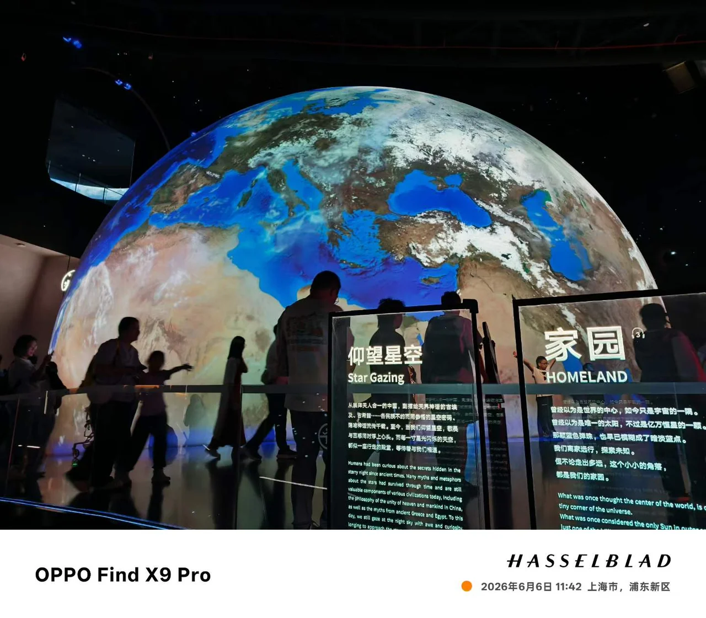
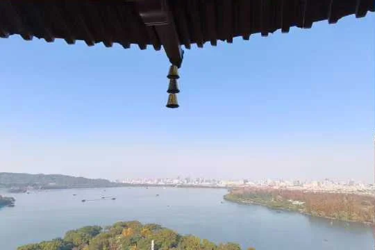

# 闫哲祯｜研究、工程与生活


你好，我是小闫，现为**同济大学资源与环境硕士研究生**。我关注工业过程建模、机器学习与约束优化，希望把复杂过程中的数据转化为可理解、可比较的决策信息。

这里保存我的个人网站源码，也作为了解我的一个入口。研究与论文、校园实践、旅行摄影、动画与阅读，都可以在网站中继续展开。

### [访问完整个人网站 →](https://xiaoyan-personal-hub.s1encisi.chatgpt.site)

[研究与项目](https://xiaoyan-personal-hub.s1encisi.chatgpt.site/projects) · [论文与成果](https://xiaoyan-personal-hub.s1encisi.chatgpt.site/publications) · [个人介绍](https://xiaoyan-personal-hub.s1encisi.chatgpt.site/about/profile) · [联系我](mailto:2431509@tongji.edu.cn)

## 关于我

- **硕士**：同济大学，资源与环境，2024—2027 年，预计 2027 年 6 月毕业。
- **本科**：大连理工大学，环境工程，2020—2024 年。
- **研究兴趣**：铜电积与电解液净化、代理模型、多目标优化、安全强化学习、模型解释与工业智能系统。
- **研究之外**：校园传播、阅读推广、自然教育、长跑、天文、城市旅行与影像记录。

## 研究与工程

| 方向 | 正在做或已经完成的工作 | 深入阅读 |
| --- | --- | --- |
| 铜电积过程预测 | 比较 10 种机器学习算法，预测槽电压与出液铜浓度，结合 SHAP 分析模型响应；第一作者论文已发表 | [项目详情](https://xiaoyan-personal-hub.s1encisi.chatgpt.site/projects/copper-electrowinning-surrogate) |
| 约束多目标优化 | ESRL-CMO：分工况代理模型与 PPO-Lagrangian，协调铜回收、砷控制、能耗和净收益；JCP 稿件修回中 | [研究框架](https://xiaoyan-personal-hub.s1encisi.chatgpt.site/projects/electrolyte-purification-optimization) |
| 研究软件 | CuLab 研究工作台，将建模、优化、诊断与结果展示连接到实际工具和交互界面 | [软件实践](https://xiaoyan-personal-hub.s1encisi.chatgpt.site/projects/culab-agent-workbench) |
| 污水处理能耗 | 使用 TabPFN 等模型研究有限样本下的能耗预测；Water Environment Research 在审 | [项目与成果](https://xiaoyan-personal-hub.s1encisi.chatgpt.site/projects/wastewater-energy-tabpfn) |
| 本科环境研究 | 省域城乡生态足迹、土地利用变化与生物炭砷吸附科研训练 | [更多项目](https://xiaoyan-personal-hub.s1encisi.chatgpt.site/projects) |

论文状态与研究概述对应网站现有记录，更新于 2026 年 9 月。具体方法、个人分工和结果条件见各项目详情。

## 生活里的另一面

我喜欢为一次现场体验留出时间：走进天文馆、沿海岸散步、去一场演出，或把一部动画看完之后的感受写下来。

| 走近宇宙 | 城市与山水 |
| --- | --- |
| [](https://xiaoyan-personal-hub.s1encisi.chatgpt.site/life/travel-walks#astronomy-and-dishui) | [](https://xiaoyan-personal-hub.s1encisi.chatgpt.site/life/travel-walks#hangzhou-weekend) |

网站收录了十篇现场图文，也保留了长期整理的动画推荐、影评和 2,276 条总表记录。

[旅行与摄影](https://xiaoyan-personal-hub.s1encisi.chatgpt.site/life/travel-walks) · [动画观测站](https://xiaoyan-personal-hub.s1encisi.chatgpt.site/life/animation) · [个人随想](https://xiaoyan-personal-hub.s1encisi.chatgpt.site/thoughts) · [实践经历](https://xiaoyan-personal-hub.s1encisi.chatgpt.site/experience)

## 在其他地方找到我

[学术邮箱](mailto:2431509@tongji.edu.cn) · [Bilibili](https://space.bilibili.com/103442064) · [Bangumi](https://bgm.tv/user/s1encisi) · [GitHub](https://github.com/s1encisi)

## 关于这个网站项目

这个仓库对应上方已经运行的个人网站。使用 **React 19、TypeScript、Vinext / Vite、Motion 与 Cloudflare Sites**，将研究、动画和生活组织为 105 个正式页面地址。首页采用天文主题，动画与摄影栏目有各自的阅读布局，导航与动效支持键盘操作和减少动态设置。

我主导需求、内容核验、设计选择与验收，使用 Codex 辅助代码实现和验证。项目说明、技术取舍与面试准备放在文档中：

- [项目介绍与演示路线](docs/PROJECT_CASE_STUDY.md)
- [面试常见问题与口述回答](docs/INTERVIEW_QA.md)
- [全站设计与验证记录](docs/REDESIGN_20260911.md)
- [本次同步记录](docs/RELEASE_20260916.md)
- [完整文档索引](docs/README.md)

### 本地运行

使用 Node.js 22.13 或以上版本；本次在 Node.js 24 下验证。本地浏览无需账号、API Key 或数据库。

```powershell
git clone https://github.com/s1encisi/xiaoyan-personal-hub.git
cd xiaoyan-personal-hub
npm ci
npm run dev
```

打开终端打印的 Local 地址，默认是 [http://localhost:3000](http://localhost:3000)。

```powershell
npm test
npm run lint
node node_modules/typescript/bin/tsc --noEmit
```

`npm test` 包含构建与页面回归检查。`app/` 保存页面、组件和内容；`public/` 保存网站图片；`docs/` 保存说明与验收记录。本次同步分支为 `codex/portfolio-release`，保留 `main`，不合并。GitHub 源码与 Sites 部署分别管理。

个人照片与文字用于个人展示；动画海报和第三方组件保留各自的来源与许可说明。
